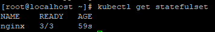
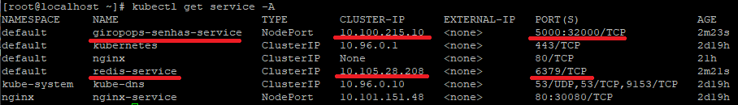

# deploy_kubernetes

Este repositório tem como objetivo apresentar o funcionamento do Kubernetes de forma direta e prática, demonstrando também como realizar o deploy de algumas aplicações. Antes de avançar para o processo de deploy, serão listadas as principais funcionalidades do Kubernetes.


 Antes de iniciarmos o deploy - **O que é Kubernetes**?

Desenvolvida pela Google em 2014 e mantido pela CNCF (Cloud Native Computing Foundation), Kubernetes (também chamado de K8s) é uma plataforma de código aberto criado com objetivo de ser um orquestrador de containers, automatizando a implantação, o escalonamento e a gestão de aplicações em containers.

***Nome Curioso, o apelido k8s veio do padrão i18n (a letra "K" seguida por oito letras e o "s" no final)***


### **Arquitetura Kubernetes**

Um Cluster K8s segue o modelo construido por control plane / workers, onde o control plane é o cérebro do cluster e o trabalho bruto é executado dentro dos Workers.


## Cluster

Um Cluster Kubernetes é um conjunto de computadores (físicos ou virtuais) que trabalham juntos para executar e gerenciar aplicações containerizadas em grande escala.

Esses computadores são chamados de nodes (nós), e eles executam unidades chamadas pods, que por sua vez contêm os containers onde as aplicações rodam.

O Cluster é composto por Nodes que podem ser tanto **control plane** quanto **workers**. 

Uma ótima analogia seria uma orquestra, onde temos uma pessoa regendo a orquestra, que é o control plane, e temos as pessoas musicistas, que estão executando os instrumentos, que são os workers.

-----

**Control-plane:** Controle do Cluster!

O **Control Plane** é o cérebro do cluster Kubernetes. Ele gerencia o estado desejado de todo ocluster, ou seja, define o que deve estar rodando, onde, como e quando.

Dentro do **control-plane** possuímos outros componentes:

  **etcd:** Banco de dados chave-valor que armazena todo estado do cluster.

  **API-server:** Trabalhando com JSON sobre HTTP, ele é a porta de entrada para gerenciar o Kubernetes. Para facilitar o gerenciamento, podemos integrar ao utilitário kubectl para facilitar a administração via requisições REST.

  **Scheduler:** Responsável pelo nó onde irá armazenar os Pods com base na quantidade de recursos disponíveis em cada nó.

  **Controller-manager:** Executa tarefas que são usadas para monitorar e executar o estado do Pod. Se um pod foi definido com 10 réplicas, o controller-manager irá ler o último estado setado no etcd e o atual estado do Pod, se divergentes, ele irá tentar concilar o pod com o estado estabelecido no etcd.

 ---

**Workers:** Trabalho bruto!

Os worker nodes são os servidores que rodam os containers da aplicação (ou seja, os pods).

  **Kubelet:** Agent que conversa diretamente com o control-manager e é executado em todos nós dos Workers com a função de garantir que os containers estejam rodando conforme ao definido no control-plane.

  **Kube-proxy:** Trabalhando como um roteador dos Pods, tem a função de rotear os pacotes de rede dos nós e pods usando IPtables ou IPVS.


**Arquitetura**
````
[Control Plane]
├─ kube-apiserver       ← Interface de controle
├─ etcd                 ← Armazena estado
├─ kube-scheduler       ← Decide onde rodar os pods
└─ kube-controller-mgr  ← Garante o estado desejado

[Worker Nodes]
├─ kubelet              ← Executor de pods
├─ kube-proxy           ← Roteamento de rede
└─ Container Runtime    ← Executa containers
````

**Exemplo:** Falamos para o k8s que precisamos de mais instâncias do Prometheus. O Control-plane irá dizer "Quero 4 instâncias" e os Works irão executar a tarefa.

FLUXO
````
kubectl apply -f app.yaml ───▶ kube-apiserver ───▶ etcd (salva estado)
                                  │
                                  ▼
                        kube-scheduler decide node
                                  │
                                  ▼
                   kubelet no node executa pod com o container runtime
                                  │
                                  ▼
                       kube-proxy gerencia o tráfego para os pods
````


----------

### Gerenciamento dos Containers

**Pod - Menor unidade do Kubernetes**

Para lidar com os containers, o K8s trabalha com uma abstração chamada de Pod. K8s não acessa o container diretamente, ele organiza dentro de um grupo denominados **Pods**, onde um Pod pode ter vários containers dividindo recursos de memórias, CPU, volumes, endereços...

---------------------------------

### **Deployment:** 

Um dos principais controllers do K8s, ele gerencia o ciclo de vida do Pod por completo, garantindo que um Pod tenha o número de réplicas determinadas dentro dos workers do cluster.

Ele também cuida de outras caracteristicas do Pod, como Portas, imagem, atualizações, Volumes e variáveis de ambiente.

Outra caracteristica é que ele também se integra e gerencia o ReplicaSet para garantir alta disponibilidade, portanto, ao criar um Deployment, automaticamente é criado um **ReplicaSet**.

**Como criar um Deployment?**

Para criar um Deployment, é necessário um arquivo YAML definindo todos os parâmetros de configuração.

**deployment.yaml**
````
apiVersion: apps/v1
kind: Deployment
metadata:
  labels:
    app: nginx-deployment
  name: nginx-deployment
spec:
  replicas: 1
  selector:
    matchLabels:
      app: nginx-deployment
  strategy: {}
  template:
    metadata:
      labels:
        app: nginx-deployment
    spec:
      containers:
      - image: nginx
        name: nginx
        resources:
          limits:
            cpu: "0.5"
            memory: 256Mi
          requests:
            cpu: 0.25
            memory: 128Mi
````

**Explicação:**

No campo **Kind:** estou definindo o tipo de objeto como *Deploymeny* e a versão da API em **apiVersion:**
````
apiVersion: apps/v1
kind: Deployment
````

Aqui defino os **metada:** e dou etiquetas aos objetos com **labels:**. Assim eu consigo utilizar essas etiquetas para configurações posteriormanete.
````
metadata:
  labels:
    app: nginx-deployment
  name: nginx-deployment
````

Aqui defino o número de réplicas para 3.
````
spec:
  replicas: 3
````

Aqui estou definindo que todos os Pods que possuírem a etiqueta "nginx-deployment" serão gerenciados por este deployment.
````
selector:
  matchLabels:
    app: nginx-deployment
````

Este campo **strategy** defini qual estratégia será usada para Update dos Pods, quando vázio **{}** a estratégia definida por padrão é **RollingUpdate**.

**RollingUpdate** é utilizada para atualizar os Pods de um Deployment de forma gradual, ou seja, ela atualiza um Pod por vez, ou um grupo de Pods por vez.
````
strategy: {}
````

Definindo o Template dos Pods que serão criados pelo Deployment. Template é o modelo que os Pods devem ser construídos. 

Ao definir no campo acima "** spec: \ selector: \ matchLabels: \ app: nginx-deployment**" o Deployment irá procurar por todos os Pods com o rótulo "**nginx-deployment**". No campo templates: eu defino o mesmo rótulo para o deployment se conectar aos Pods criados.
````
template:
  metadata:
    labels:
      app: nginx-deployment
````

Aqui estou definindo que os Pods terão a imagem do **Nginx**.
````
  spec:
    containers:
    - image: nginx
      name: nginx
````
Aqui eu defino os Recursos de Memória e Hardware.
No campo **limits** é definido a quantidade máxima que cada container pode usar. E em **requests** é definido a quantidade reservada de CPU e Memória.
````
      resources:
        limits:
          cpu: "0.5"
          memory: 256Mi
        requests:
          cpu: 0.25
          memory: 128Mi
````

**Para aplicar o deployment:** *kubectl apply -f nome_do_deployment.yaml

````
kubectl apply -f deployment.yaml
````

Verificando o deployment criado:
````
kubectl get deployments -l app=nginx-deployment
````


Posso também verificar todos os Pods que o Deployment está gerenciando.

````
kubectl get pods -l app=nginx-deployment
````


----------------------

### **ReplicaSets:** 

Responsável por garantir a quantidade de Pods em execução dentro do **nó**. Ao criar um deployment, automaticamente um ReplicaSet é criado e esse ReplicaSet irá criar os Pods listados dentro do Deployment.

**Listando os Pods do ReplicaSet criados pelo Deployment nginx-deployment**
````
kubectl get replicasets -l app=nginx-deployment
````
Como o ReplicaSet cria os Pods, podemos ver a quantidade de Pods criados.


**Listando todos ReplicaSet do Cluster:**

````
kubectl get replicasets
````

**Apagando ReplicaSet**
````
kubectl delete replicaset nginx-replicaset
````
-----------------------

# DaemonSet

DaemonSet tem a função de manter uma cópia do Pod em todos os Nós do Cluster. Muito usado para tarefas de infraestrutura, um exemplo de uso é quando precisamos manter um Pod de monitoramento em todos os Nós do Cluster.

Portanto, se um cluster possuir 3 nós, o DemonSet irá garantir que todos os nós executem uma réplica do Pod.

**Criando um DaemonSet**


````
nano node-exporter-daemonset.yaml
````


node-exporter-daemonset.yaml
````
apiVersion: apps/v1 # Versão da API do Kubernetes do objeto
kind: DaemonSet # Tipo do objeto
metadata: # Informações sobre o objeto
  name: node-exporter # Nome do objeto
spec: # Especificação do objeto
  selector: # Seletor do objeto
    matchLabels: # Labels que serão utilizadas para selecionar os Pods
      app: node-exporter # Label que será utilizada para selecionar os Pods
  template: # Template do objeto
    metadata: # Informações sobre o objeto
      labels: # Labels que serão adicionadas aos Pods
        app: node-exporter # Label que será adicionada aos Pods
    spec: # Especificação do objeto, no caso, a especificação do Pod
      hostNetwork: true # Habilita o uso da rede do host, usar com cuidado
      containers: # Lista de contêineres que serão executados no Pod
      - name: node-exporter # Nome do contêiner
        image: prom/node-exporter:latest # Imagem do contêiner
        ports: # Lista de portas que serão expostas no contêiner
        - containerPort: 9100 # Porta que será exposta no contêiner
          hostPort: 9100 # Porta que será exposta no host
        volumeMounts: # Lista de volumes que serão montados no contêiner, pois o node-exporter precisa de acesso ao /proc e /sys
        - name: proc # Nome do volume
          mountPath: /host/proc # Caminho onde o volume será montado no contêiner
          readOnly: true # Habilita o modo de leitura apenas
        - name: sys # Nome do volume 
          mountPath: /host/sys # Caminho onde o volume será montado no contêiner
          readOnly: true # Habilita o modo de leitura apenas
      volumes: # Lista de volumes que serão utilizados no Pod
      - name: proc # Nome do volume
        hostPath: # Tipo de volume 
          path: /proc # Caminho do volume no host
      - name: sys # Nome do volume
        hostPath: # Tipo de volume
          path: /sys # Caminho do volume no host
````

Aplicando o DaemonSet
````
kubectl apply -f node-exporter-daemonset.yaml
````

Verificando o DaemonSet criado
````
kubectl apply -f node-exporter-daemonset.yaml
````

Exibir Pods gerenciados pelo DaemonSet
````
kubectl get pods -l app=node-exporter
````


--------------------

# Probes

Probes são uma forma de monitorar os Pods automaticamente com a finalidade de saber o estado de vida do Pod. Através do status do Pod, decisções são tomadas como por exemplo: Reiniciar containers, remover containers, saber se deve ou não enviar dados para container.


As Probes são dividas em 3 tipos: **LivenessProbe**, **ReadinessProbe** e **StartupProbe**.

### LivenessProbe.

A LivenessProble é responsável por verificar a integridade do Pod, através dela é possível ver oque está rodando dentro do Pod e se está respondendo conforme o esperado.

**Exemplo LivenessProbe:

nginx-liveness.yaml
````
apiVersion: apps/v1
kind: Deployment
metadata:
  labels:
    app: nginx-deployment
  name: nginx-deployment
spec:
  replicas: 3
  selector:
    matchLabels:
      app: nginx-deployment
  strategy: {}
  template:
    metadata:
      labels:
        app: nginx-deployment
    spec:
      containers:
      - image: nginx:1.19.2
        name: nginx
        resources:
          limits:
            cpu: "0.5"
            memory: 256Mi
          requests:
            cpu: 0.25
            memory: 128Mi
        livenessProbe: # definindo Probe como livenessProbe
          tcpSocket: # conecta o container via TCP
            port: 80 # atacando a porta 80
          initialDelaySeconds: 10 # Tempo para executar a primeira verificação
          periodSeconds: 10 # Tempo de repetição
          timeoutSeconds: 5 # se o container não responder neste tempo, irá ser marcado como Falha.
          failureThreshold: 3 # Quantos falhas consecutivas vamos aceitar antes de reiniciar o container
````

Apply
````
kubectl apply -f nginx-liveness.yaml
````


Irei visualizar os pods nginx-deployment
````
kubectl get pods -l app=nginx-deployment
````


Com o "Describe" eu consigo visualizar o Tipo de Probe do Deployment.
````
kubectl describe pod nginx-deployment-56866f4985-ngg7j
````

Liveness aplicada com sucesso, delay de 10s e timeout de 5s.

````
tcp-socket :80 delay=10s timeout=5s period=10s #success=1 #failure=3
````


### Testando a Probe

Para realizar um teste simples, irei acessar o Pod e matar o processo do Nginx ver a Probe entrando em ação.

````
kubectl exec -it nginx-deployment-56866f4985-ngg7j -- /bin/bash
````


Probe funcionando corretamente, caso não estivesse nenhuma Probe configurada, o Kubernetes não iria saber que o processo morreu, o Pod ficaria como Running porém a aplicação não iria funcionar.


### ReadinessProbe.

ReadinessProbe é usada para verificar se o container está pronto para receber tráfego e requisições da rede externa.

Exemplo de ReadinessProbe:

nginx-readiness.yaml
```
apiVersion: apps/v1
kind: Deployment
metadata:
  labels:
    app: nginx-deployment
  name: nginx-deployment
spec:
  replicas: 3
  selector:
    matchLabels:
      app: nginx-deployment
  strategy: {}
  template:
    metadata:
      labels:
        app: nginx-deployment
    spec:
      containers:
      - image: nginx:1.19.2
        name: nginx
        resources:
          limits:
            cpu: "0.5"
            memory: 256Mi
          requests:
            cpu: 0.25
            memory: 128Mi
        readinessProbe: # Onde definimos a nossa probe de leitura
          httpGet: # O tipo de teste que iremos executar, neste caso, iremos executar um teste HTTP
            path: / # O caminho que iremos testar
            port: 80 # A porta que iremos testar
          initialDelaySeconds: 10 # O tempo que iremos esperar para executar a primeira vez a probe
          periodSeconds: 10 # De quanto em quanto tempo iremos executar a probe
          timeoutSeconds: 5 # O tempo que iremos esperar para considerar que a probe falhou
          successThreshold: 2 # O número de vezes que a probe precisa passar para considerar que o container está pronto
          failureThreshold: 3 # O número de vezes que a probe precisa falhar para considerar que o container não está pronto

```

### Explicação ReadinessProbe

Com a Probe readiness o Deployment do Nginx só irá trafegar dados para containers que estão prontos.

````
readinessProbe:
  httpGet:
    path: / #Verifica o Patch que o Nginx responde
    port: 80 #porta do Nginx
  initialDelaySeconds: 10 # Aguarda 10s após inicio do container para a 1º checagem
  periodSeconds: 10 # Chega a cada 10s
  timeoutSeconds: 5 # Timeout de 5s para marca como Falha
  successThreshold: 2 # Pasa 2 vezes seguidas para o Pod ser considerado Pronto
  failureThreshold: 3 # Se falhar 3 vezes, o Pod não é considerado como pronto
````

Enquanto o Pod não estiver pronto, o Service não irá encaminhar trafeco para ele.

````
kubectl get pods -l app=nginx-deployment -w
````


Visualizando os Deployment Nginx

````
kubectl get pods -l app=nginx-deployment -o wide
````

Irei entrar no Pod "nginx-deployment-575868f94-5wnx7" e matar o processo do Nginx.

````
kubectl exec -it nginx-deployment-575868f94-5wnx7 -- /bin/bash
````


O Pod ficou com status **READY 0/1** oque siginifica não pronto.


O Pod foi reiniciado porque o único processo existente morreu e só voltou a receber trafego após o status como "Pronto" **READY 1/1**. Se não houvesse nenhuma Probe configurada, o status ficaria como **READY 1/1** mesmo o Pod não executando o serviço principal até o Pod morrer. Com readinessProbe o Pod recebe **READY 0/1** imediatamente.


### StartupProbe

StartupProbe é responsável por verificar se o container foi incializado corretamente e se está pronto para operar. Ela é semelhante a readinessProbe, a única diferença é que ela é executado uma única vez no começo de vida do conteiner.


````
nano nginx-liveness.yaml
````
nginx-liveness.yaml
````
apiVersion: apps/v1
kind: Deployment
metadata:
  labels:
    app: nginx-deployment
  name: nginx-deployment
spec:
  replicas: 3
  selector:
    matchLabels:
      app: nginx-deployment
  strategy: {}
  template:
    metadata:
      labels:
        app: nginx-deployment
    spec:
      containers:
      - image: nginx:1.19.2
        name: nginx
        resources:
          limits:
            cpu: "0.5"
            memory: 256Mi
          requests:
            cpu: 0.25
            memory: 128Mi
        livenessProbe: # Aqui é onde vamos adicionar a nossa livenessProbe
          tcpSocket: # Aqui vamos utilizar o tcpSocket, onde vamos se conectar ao container através do protocolo TCP
            port: 80 # Qual porta TCP vamos utilizar para se conectar ao container
          initialDelaySeconds: 10 # Quantos segundos vamos esperar para executar a primeira verificação
          periodSeconds: 10 # A cada quantos segundos vamos executar a verificação
          timeoutSeconds: 5 # Quantos segundos vamos esperar para considerar que a verificação falhou
          failureThreshold: 3 # Quantos falhas consecutivas vamos aceitar antes de reiniciar o contai
````


-------------------

# **Services:** 

Services tem a função de expor os Pods na rede permitindo uma comunicação da rede Externa para dentro da Lan do Cluster. Eles são um conjunto de Pods que trabalham para expor outros Pods na rede. Eles são definidos através de Manifest YAML.


### **Tipos de Services:**

    ClusterIP: Padrão ao ser deployado no cluster, tem a função de expor serviços somente dentro do próprio cluster, fazendo uma comunicação interna entre os serviços.

    exemplo:

    spec:
        type: ClusterIP
        ports:
          - port: 80
           targetPort: 8080


    NodePort: Geralmente usada entre as portas 30000 - 32767, tem a função de expor o pod para a rede Externa.

    exemplo:

    spec:
      type: NodePort
      ports:
        - port: 80
          targetPort: 8080
          nodePort: 30080


    LoadBalander: Usado para expor aplicações diretamente na Wan como um balanceador de carga. 

    exemplo:

    spec:
      type: LoadBalancer
      ports:
        - port: 80
          targetPort: 8080

    ExternalName: Mapeia o Service para o conteúdo do campo externalName (por exemplo, foo.bar.example.com), retornando um registro CNAME com seu valor.

  

O Service atríbui políticas em um conjunto de Pods para poderem ser acessados, essas políticas são atribuídas por rótulos(**Label Selectors**) dentro do manifest YAML.

### Endpoints

Quando um Service é criado, automaticamente é criado outro objeto dentro do K8s chamado Endpoint, o Endpoint tem a função de rastrear os IPs e Ports dos Pods que correspondem ao rótulo declarado no Service.

Para visualizar o Endpoint:
````
kubectl get endpoints meu-service
````

Verificar todos EndPoints de Todos Services.
````
kubectl get endpoints -A
````
### Criando Service

O Service pode ser criado tanto na linha de comando quanto via manifest YAML.

**CusterIP**

Exemplo de criação de um Service do tipo ClusterIP via linha de Comando:
````
kubectl expose deployment meu-deployment --port=80 --target-port=8080
````

Manifest YAML do comando acima:
````
apiVersion: v1
kind: Service # Tipo do objeto, no caso, um Service
metadata:
  name: meu-service
spec:
  selector: # Seleciona os Pods que serão expostos pelo Service
    app: meu-app # Neste caso, os Pods com o label app=meu-app
  ports:
    - protocol: TCP
      port: 80 # Porta do Service
      targetPort: 8080 # Porta dos Pods
````

Este arquivo YAML irá criar um serviço que corresponde aos Pods com o label app=meu-app, e encaminha o tráfego da porta 80 do serviço para a porta 8080 dos Pods. 

Perceba que estou usando o selector para definir quais Pods serão expostos pelo Service.

**NodePort**

Para ter um Service NodePort é necessário ter as portas entre 30000 e 32767.

````
kubectl expose deployment meu-deployment --type=NodePort --port=80 --target-port=8080
````

````
apiVersion: v1
kind: Service
metadata:
  name: meu-service
spec:
  type: NodePort # Tipo do Service
  selector:
    app: meu-app
  ports:
    - protocol: TCP
      port: 80 # Porta do Service, que será mapeada para a porta 8080 do Pod
      targetPort: 8080 # Porta dos Pods
      nodePort: 30080   # Porta do Node, que será mapeada para a porta 80 do Service
````

**LoadBalancer**

LoadBalancer é uma das melhores formas de expor uma aplicação para internet, quando deployado, automaticamente é criado um balanceador de carga expondo o Kubernetes.

LoadBalancer via CLI:
````
kubectl expose deployment meu-deployment --type=LoadBalancer --port=80 --target-port=8080
````

LoadBalancer YAML:
````
apiVersion: v1
kind: Service
metadata:
  name: meu-service
spec:
  type: LoadBalancer
  selector:
    app: meu-app
  ports:
    - protocol: TCP
      port: 80
      targetPort: 8080
````

Verificando Services de um Cluster:
````
kubectl get services
````


Verificando Services de uma Namespace: 
````
kubectl get services -n kube-system
````


Todas os Services de todas namespace:
`````
kubectl get services -A
`````

Todos detalhes do Service:
````
kubectl describe service meu-service
````

Removendo o Service:
````
kubectl delete service meu-service
````

**Portas K8s**
````
| Componente           | Porta     | Protocolo | Descrição                  |
| -------------------- | --------- | --------- | -------------------------- |
| `kube-apiserver`     | 6443      | HTTPS     | Principal API do cluster   |
| `etcd`               | 2379–2380 | HTTPS     | Armazena estado do cluster |
| `kube-scheduler`     | 10259     | HTTPS     | Comunicação interna        |
| `controller-manager` | 10257     | HTTPS     | Gerencia controladores     |
| `kubelet`            | 10250     | HTTPS     | Comunicação com o nó       |
| `kube-proxy`         | 10256     | HTTP      | Gerencia regras de rede    |
````

------------


# DEPLOY CLUSTER KUBERNETES

Agora que já foi explicado os principais componentes do K8s. Irei criar meu cluster K8s localmente usando o KinD.

[KinD](https://github.com/kubernetes-sigs/kind) (Kubernetes IN Docker) é uma ferramenta que permite rodar clusters Kubernetes inteiros dentro de containers Docker, de forma rápida, leve e local. Ele criado principalmente para desenvolvimento, testes e CI/CD, permitindo simular um ambiente Kubernetes sem precisar de VMs, cloud, ou uma instalação pesada. Outra forma de efetuar deploy do K8s localmente é com o [Minikube](https://minikube.sigs.k8s.io/docs/start/?arch=%2Fwindows%2Fx86-64%2Fstable%2F.exe+download).

Irei instalar o KinD seguindo os requisitos da documentação, como ele usa containers Docker para criar os clusters, irei instalar o Docker.

Instalando Docker:
````
sudo dnf config-manager --add-repo=https://download.docker.com/linux/centos/docker-ce.repo
sudo dnf install docker-ce docker-ce-cli containerd.io
sudo systemctl enable --now docker
````

Permissão ao usuário para usar o Docker
````
sudo usermod -aG docker $USER
newgrp docker
````


Docker Instalado!


------------------------

Deploy KinD
````
curl -Lo ./kind https://kind.sigs.k8s.io/dl/v0.22.0/kind-linux-amd64
chmod +x kind
sudo mv kind /usr/local/bin/
````
Desligando swap (recomendo em ambientes K8s)
````
sudo swapoff -a
````

Rode "***kind version***" para verificar a instalação.


KinD instalado com sucesso!

Para facilitar o gerenciamento do K8s, irei utilizar o utilitário ***kubectl***.

Instalando kubectl:
````
curl -LO https://dl.k8s.io/release/v1.33.0/bin/linux/amd64/kubectl
chmod +x kubectl
sudo mv kubectl /usr/local/bin/
````
````
kubectl version --client
````


Dependências instaladas com sucesso! Agora irei iniciar o processo de criação do Cluster.

````
kind create cluster --name meu-cluster
````
Cluster Criado.


Verificando o Cluster:
````
kind get clusters
````


Como o KinD utiliza Docker, com o comando "**Docker ps**" posso visualizar o container criado.


Verificando informações do Cluster:
````
kubectl cluster-info
````
O Control Plane está rodando localmente (Kind usa localhost com uma porta aleatória).O DNS interno (CoreDNS) está ativo — essencial para comunicação entre pods.


Verificando Nodes(Nós):
````
kubectl get node
````
Um único node (control-plane), com a versão v1.29.2. Está com status Ready, ou seja: funcional e aceitando workloads.


Verificando todos os Pods:
````
kubectl get pods -A
````
Aqui posso ver todos os Pods em Status "Running" no meu cluster.


| Pod                              | Função                                                |
|----------------------------------|--------------------------------------------------------|
| `coredns-xxxx`                   | Resolve nomes DNS dentro do cluster                   |
| `etcd-meu-cluster-control-plane` | Banco de dados do cluster                             |
| `kube-apiserver-meu-cluster...`  | API do cluster                                        |
| `kube-controller-manager-...`    | Controla estados de recursos                          |
| `kube-scheduler-...`             | Decide onde rodar pods                                |
| `kube-proxy`                     | Roteamento de rede                                    |
| `kindnet`                        | Plugin de rede (CNI) usado pelo Kind                  |
| `local-path-provisioner`         | Provisionador de volumes persistentes localmente      |


**Cluster Rodando!**

### Primeiro Deploy no Cluster
Agora irei instalar uma aplicação do nginx como teste de deployment com o comando "***kubectl create nome_do_pod --imagem=***".

**Deployment nginx**
````
kubectl create deployment nginx --image=nginx
````
Ao utilizar "***kubectl create***" o container nginx é baixado diretamente do Docker Hub, que é o repositório público padrão de imagens Docker. Ao passar parametro "--image=nginx" a imagem será buscada em "*docker.io/library/nginx:latest*".

O Kubectl envia o comando para criar o Deployment para o KubeAPI dentro do Control-plane, o control-plane envia a solicitação para o Kubelet receber dentro do Worker. Após a requisição ser recebida, o container runtime irá começar a baixar a imagem direto do Docker Hub.


Ao criar um novo deployment, o status do container fica como "ContainerCreating".


Após esperar alguns segundos, o status muda para "Running".


Criando Serviço na porta 80 como NodePort.
````
kubectl expose deployment nginx --port=80 --type=NodePort

kubectl get svc
````


Aplicação Deployada e Service criados com sucesso!

Agora irei deletar os pods criados.

**Deletando deployment:** 
````
kubectl delete deployment nginx  
````

**Deletando service:** 
````
kubectl delete service nginx  
````

Posso verificar se ainda existe algum deployment ou service do nginx com **kubectl get ALL**

Podemos notar que todos pods nginx foram excluídos.


-------------------


**Deletando CLUSTER KIND**

````
kind delete cluster --name meu-cluster
````


Cluster KinD Excluído!

-----------
### Criando Cluster personalizado via manifest YAML

Outra forma de trabalhar com o Kind é através de manifest **.yaml** onde podemos definir parâmetros de porta, redes, quantidades de nodes e Workers.

Irei criar um novo arquivo .yaml definindo as configurações do Cluster.

````
nano kind-config.yaml
````
kind-config.yaml
````
kind: Cluster #Definindo como Cluster
apiVersion: kind.x-k8s.io/v1alpha4 #Atacando a API
networking: #aqui estou personalizando a rede do cluster
  apiServerAddress: "192.168.2.63"  # IP do host físico
  apiServerPort: 17443 #porta
  podSubnet: "10.244.0.0/16" #Rede dos Pods
  serviceSubnet: "10.96.0.0/12" #Rede dos Services

nodes:
  - role: control-plane #Define o node como Master
    extraPortMappings: # as Portas abaixo define um roteamento do Servidor para dentro do cluster
      - containerPort: 80
        hostPort: 80
      - containerPort: 443
        hostPort: 443
      - containerPort: 6443
        hostPort: 17445
      - containerPort: 30080
        hostPort: 30080  

  - role: worker #Nó onde executará os Pods
````

Detalhe: No campo "**apiVersion: kind.x-k8s.io/v1alpha4**" estou atacando a API do K8S. Para mais detalhes sobre a API, rode:
````
kubectl api-resources
````


**Deploy**

Irei realizar o deploy com o comando "**kind create cluster --name nome_do_cluster --config meu_manifest.yaml**"
````
kind create cluster --name meu-cluster --config kind-config.yaml
````

**Cluster deployado via manifest, os Pods estão sendo criados.**


Meus 2 Nodes foram criados com sucesso!


----------------------

### NAMESPACE

Como já sabemos, Docker ou outros tipos de containers são isolamentos de recursos, onde o Linux mente para a aplicação fazendo ela executar como se estivesse em outra máquina com seus próprios recursos de soft e hardware.

As Namespace são as responsáveis por este papel, elas são uma divisão lógica do Linux onde permite isolar recursos, dentro do Cluster podemos usar namespaces para ter vários ambientes, pods, services, deployments...

Podemos verificar todas as namespaces do cluster:
````
kubectl get namespaces
````
Ao efetuar deploy do KinD, ele já cria todas as namespaces necessários para o cluster automaticamente.


Para verificar os Pods de uma namespace: **kubectl get pods -n nome_da_namespace

Verificando pods da namespace kube-system:
````
kubectl get pod -n kube-system
````


Para verificar todos pods de todas namespaces:
````
kubectl get pods -A
````

-----------------------------------

### Deploy Nginx no Cluster via manifest YAML

Agora irei criar um manifest incluindo Namespace, Deployment e Service.

````
nano nginx_kubernetes.yaml
````

**Manifest nginx_kubernetes.yaml**
````
# Namespace
apiVersion: v1
kind: Namespace
metadata:
  name: nginx

---
# Deployment
apiVersion: apps/v1
kind: Deployment
metadata:
  name: nginx-deploy
  namespace: nginx
spec:
  replicas: 2
  selector:
    matchLabels:
      app: nginx
  template:
    metadata:
      labels:
        app: nginx
    spec:
      containers:
        - name: nginx
          image: nginx:latest
          ports:
            - containerPort: 80

---
# Service
apiVersion: v1
kind: Service
metadata:
  name: nginx-service
  namespace: nginx
spec:
  selector:
    app: nginx
  type: NodePort
  ports:
    - port: 80
      targetPort: 80
      nodePort: 30080  # Porta acessível no host
````
**Realizando o deployment:** kubectl apply -f nome_do_manifest.yaml
````
kubectl apply -f nginx_kubernetes.yaml
````


Com o comando **kubectl get all -n nginx** eu posso visualizar todos os pods da namespace nginx.

````
kubectl get all -n nginx
````

**Deployment** e **Services** nginx criados com sucesso.


Testando Pods Nginx:

Com os Pods em Running, o Service está apontando para a porta 30080 e o Type está como NodePort, ou seja, o Pod do Nginx está sendo exposto para rede.
````
curl https://127.0.0.1:30080
````

Curl retornando a página web do nginx.


**LEMBRE-SE** - No manifest para deploy do cluster *kind-config.yaml* eu passei o parametro para expor a porta:

````
- containerPort: 30080
        hostPort: 30080  
````
**Acesso Web Nginx:**


Aplicação Deployada e acessada com sucesso! Agora irei mencionar algumas outras aplicações importantes de um Cluster Kubernetes.

----------

# Volumes no Kubernetes

Os Volumes no Kubernetes são diretórios dentro do Pod utilizados para armazenar os dados. Existem 2 tipos de volumes, os **ephemeral volumes** e os **persistent volumes**.

**Ephemeral Volumes** = São volumes criados e destruídos junto com o Pod, qualquer problema com o Pod ele será excluído junto.

**Persistent** = São volumes que são criados e não são destruídos quando o Pod morre, eles são persistidos e os dados são mantidos mesmo quando o Pod é excluído.


## Volumes Storage Class

**Storage Class** é um objeto que descreve classes de armazenamento disponível no Cluster. Ela é útil para gerenciar diferentes tipos de armazenamento e também pode ser usada para definir políticas de retenção, provisionamento e outras características de armazenamento.

Cada StorageClass é definida com um provisionador, que é responsável por criar PersistentVolumes dinamicamente conforme necessário. Os provisionadores podem ser internos (fornecidos pelo próprio Kubernetes) ou externos (fornecidos por provedores de armazenamento específicos).

Para ver a lista completa de provisionadores, consulte a documentação do Kubernetes no link https://kubernetes.io/docs/concepts/storage/storage-classes/#provisioner.

Verificando o Storage Class disponível no Cluster:
````
kubectl get storageclass
````

Como estou no KinD, o padrão é o "rancher.io/local-path" que cria volumes **PersistentVolume** no diretório do host.


Posso usar o **Describe** para ver os detalhes do Storage Class:
````
kubectl describe storageclass standard
````


## PV - Persistent Volume


PV é um objeto no K8s que representa um armazenamento físico dentro do cluster. Ele pode ser um HD, SSD, NAS ou algum serviço Cloud como, por exemplo o AWS EBS.

Ele é utilizado para fornecer armazenamento durável, os dados são armazenados mesmo quando o Pod morre, reiniciados ou movidos de Node.

Consultar Persistent Volume disponível:
````
kubectl get pv -A
````
Como o PV não é ativo por default, nenhum armazenamento PV é encontrado.


### Criando Armazenamento PV - Persistent Volume


pv.yaml
````
apiVersion: v1 # Versão da API do Kubernetes
kind: PersistentVolume # Tipo de objeto que estamos criando, no caso um PersistentVolume
metadata: # Informações sobre o objeto
  name: meu-pv # Nome do nosso PV
  labels:
    storage: local
spec: # Especificações do nosso PV
  capacity: # Capacidade do PV
    storage: 1Gi # 1 Gigabyte de armazenamento
  accessModes: # Modos de acesso ao PV
    - ReadWriteOnce # Modo de acesso ReadWriteOnce, ou seja, o PV pode ser montado como leitura e escrita por um único nó
  persistentVolumeReclaimPolicy: Retain # Política de reivindicação do PV, ou seja, o PV não será excluído quando o PVC for excluído
  hostPath: # Tipo de armazenamento que vamos utilizar, no caso um hostPath
    path: "/mnt/data" # Caminho do hostPath, do nosso nó, onde o PV será criado
  storageClassName: standard # Nome da classe de armazenamento que será utilizada
  ````

Aplicando pv.yaml
````
kubectl apply -f pv.yaml
````


Listando PV do Cluster
````
kubectl get pv
````


Visualizando os detalhes do PV
`````
kubectl describe pv meu-pv
`````
O PV utiliza o **host


### VOLUME NFS com Persistent Volume

Para adicionar um volume NFS no cluster, irei criar um diretório compartilhado com os nodes do cluster em */etc/nfs*. 

Criando diretório NFS:
````
mkdir /mnt/nfs
````

OBS: Os pacotes *nfs-kernel-server* e *nfs-common* são necessários para o NFS funcionar.
````
sudo yum install nfs-utils

````
````
sudo systemctl enable --now rpcbind
sudo systemctl enable --now nfs-server
sudo systemctl enable --now nfs-mountd
sudo systemctl enable --now nfs-idmapd
````

Para configura o NFS teremos que editar o arquivo */etc/exports*
````
nano /etc/exports
````
````
/mnt/nfs *(rw,sync,no_root_squash,no_subtree_check)
````

````
/mnt/nfs: é o diretório que você deseja compartilhar.

*: permite que qualquer host acesse o diretório compartilhado. Para maior segurança, você pode substituir * por um intervalo de IPs ou por IPs específicos dos clientes que terão acesso ao diretório compartilhado. Por exemplo, 192.168.1.0/24 permitiria que todos os hosts na sub-rede 192.168.1.0/24 acessassem o diretório compartilhado.

rw: concede permissões de leitura e gravação aos clientes.

sync: garante que as solicitações de gravação sejam confirmadas somente quando as alterações tiverem sido realmente gravadas no disco.

no_root_squash: permite que o usuário root em um cliente NFS acesse os arquivos como root. Caso contrário, o acesso seria limitado a um usuário não privilegiado.

no_subtree_check: desativa a verificação de subárvore, o que pode melhorar a confiabilidade em alguns casos. A verificação de subárvore normalmente verifica se um arquivo faz parte do diretório exportado.
````

Adicinando o diretório ao NFS:
````
exportfs -arv
````


Exibindo o ponto de montagem:
````
showmount -e
````


**NFS FUNCIONANDO**

### StorageClass para provisionar NFS e associnar ao PV

Irei criar um manifest YAML para provisionar o NFS no cluster.

````
nano storageclass-nfs.yaml
````

storageclass-nfs.yaml
````
apiVersion: storage.k8s.io/v1 # Versão da API do Kubernetes
kind: StorageClass # Tipo de objeto que estamos criando, no caso um StorageClass
metadata: # Informações sobre o objeto
  name: nfs # Nome do nosso StorageClass
provisioner: kubernetes.io/no-provisioner # Provisionador que será utilizado para criar o PV
reclaimPolicy: Retain # Política de reivindicação do PV, ou seja, o PV não será excluído quando o PVC for excluído
volumeBindingMode: WaitForFirstConsumer
parameters: # Parâmetros que serão utilizados pelo provisionador
  archiveOnDelete: "false" # Parâmetro que indica se os dados do PV devem ser arquivados quando o PV for excluído
````

````
kubectl apply -f storageclass.yaml
````


StorageClass criado, irei criar outro manifesto para associnar ao PV.

````
nano pv-nfs.yaml
````

`````
apiVersion: v1 # Versão da API do Kubernetes
kind: PersistentVolume # Tipo de objeto que estamos criando, no caso um PersistentVolume
metadata: # Informações sobre o objeto
  name: meu-pv-nfs # Nome do nosso PV
  labels:
    storage: nfs # Label que será utilizada para identificar o PV
spec: # Especificações do nosso PV
  capacity: # Capacidade do PV
    storage: 1Gi # 1 Gigabyte de armazenamento
  accessModes: # Modos de acesso ao PV
    - ReadWriteOnce # Modo de acesso ReadWriteOnce, ou seja, o PV pode ser montado como leitura e escrita por um único nó
  persistentVolumeReclaimPolicy: Retain # Política de reivindicação do PV, ou seja, o PV não será excluído quando o PVC for excluído
  nfs: # Tipo de armazenamento que vamos utilizar, no caso o NFS
    server: IP_DO_SERVIDOR_NFS # Endereço do servidor NFS
    path: "/mnt/nfs" # Compartilhamento do servidor NFS
  storageClassName: nfs # Nome da classe de armazenamento que será utilizada
`````

Aplicando:
````
kubectl apply -f pv-nfs.yaml
````


**PV Criado!***

### PVC - Persistent Volume Claim

O PVC é uma solicitação de armazenamento feita pelos usuários ou aplicações do cluster. O PVC funciona como uma "assinatura" que reivindica um PV para ser usuado por algum contêiner. O K8s sempre irá tentar associar um PVC a um PV compatível automaticamente para que os dados sejam alocados corretamente.

Todo PVC é associado a um Storage Class ou a um Persistent Volume. O Storage Class irá dizer qual tipo de armazenamento e o Persistent Volume irá dizer quem é o dispositivo.


Irei criar um objeto PVC:

````
nano pvc.yaml
````

pvc.yaml
````
apiVersion: v1 # versão da API do Kubernetes
kind: PersistentVolumeClaim # tipo de recurso, no caso, um PersistentVolumeClaim
metadata: # metadados do recurso
  name: meu-pvc # nome do PVC
spec: # especificação do PVC
  accessModes: # modo de acesso ao volume
    - ReadWriteOnce # modo de acesso RWO, ou seja, somente leitura e escrita por um nó
  resources: # recursos do PVC
    requests: # solicitação de recursos
      storage: 1Gi # tamanho do volume que ele vai solicitar
  storageClassName: nfs # nome da classe de armazenamento que será utilizada
  selector: # seletor de labels
    matchLabels: # labels que serão utilizadas para selecionar o PV
      storage: nfs # label que será utilizada para selecionar o PV
````

Aplicando:
````
kubectl apply -f pvc.yaml
````


Conferindo PVC:
````
kubectl get pvc
````


O PVC ficou com status em "Pedding" pois não possuí nenhum Pod vinculado, ele está esperando alguma conexão.

Vou criar um Pod e vincular ao PVC.


pod-pvc.yaml
````
apiVersion: v1
kind: Pod
metadata:
  name: nginx-pod
spec:
  containers:
  - name: nginx
    image: nginx:latest
    ports:
    - containerPort: 80
    volumeMounts:
    - name: meu-pvc
      mountPath: /usr/share/nginx/html
  volumes:
  - name: meu-pvc
    persistentVolumeClaim:
      claimName: meu-pvc
````

````
kubectl apply -f pod-pvc.yaml
````

Verificando novamente o PVC e PV.

`````
kubectl get pvc
`````

Agora o PVC está vinculado.


````
kubectl get pv
````
O Status do PV também está como Vinculado


Agora posso usar o **Describe** para visualizar se o Pod está usando o volume correto.


````
kubectl describe pod nginx-pod
````


----------------------------


# StatefulSet

O StatefulSet tem a função de gerenciar os deployment e o scaling de um conjunto Pods, garantindo a ordem de Deployment e a singularidade dos Pods, dando mais segurança para aplicações de longo prazo.

Aplicações que usam StatefulSet:
````
Identidade de rede estável e única.
Armazenamento persistente estável.
Ordem de deployment e scaling garantida.
Ordem de rolling updates e rollbacks garantida.
Algumas aplicações que se encaixam nesses requisitos são bancos de dados, sistemas de filas e quaisquer aplicativos que necessitam de persistência de dados ou identidade de rede estável.
````

**Funcionamento**: StatefulSet funciona criando um lote de Pods replicados em que cada réplica é uma instância da mesma aplicação que é criada a parti do mesmo **spec:**. Mesmo compartilhamendo o mesmo **spec:** eles podem conter índices e hostnames diferentes.

Exemplo: Um StatefulSet com nome Nginx e um **spec** com 3 réplicas, será criado os Pods: Nginx-0, Nginx-1, Nginx-2. O pod Nginx-1 não será iniciado até que o Pods Nginx-0 esteja pronto.

Isso é útil para aplicações que precisam de um armazenamento persistente e estável, como bancos de dados.


### Headless Services

Headless Service funciona junto ao StatefulSet, ele funciona como um Service que ao invés de criar IPs Lógicos para e entregar para os Pods, ele encaminha o tráfego diratamente para os Pods que possuem IP associados a ele. Quando um StatefulSet cria os Pods, o Headless entra em ação criando um serviço de gerenciamento de DNS.

Cada Pod obtém um DNS com formato "<pod-name>.<service-name>.<namespace>.svc.cluster.local" assim os Pods conseguem ser roteados individualmente.

**Exemplo:** 3 Pods nginx são criados com StatefulSet, nginx-0, nginx-1 e nginx-2, logo o Headless Service irá entrar em ação criando rotas para cada Pod individualmente:
````
nginx-0.nginx.default.svc.cluster.local
nginx-1.nginx.default.svc.cluster.local
nginx-2.nginx.default.svc.cluster.local
````

Essa combinação de StatefulSets com Headless Services permite que aplicações stateful, como bancos de dados, tenham uma identidade de rede estável e previsível, facilitando a comunicação entre diferentes instâncias da mesma aplicação.

### Criando um StatefulSet


````
nano nginx-statefulset.yaml
````

nginx-statefulset.yaml
````
apiVersion: apps/v1
kind: StatefulSet # Tipo do recurso que estamos criando, no caso, um StatefulSet
metadata:
  name: nginx
spec:
  serviceName: "nginx"
  replicas: 3
  selector:
    matchLabels:
      app: nginx
  template:
    metadata:
      labels:
        app: nginx
    spec:
      containers:
      - name: nginx
        image: nginx
        ports:
        - containerPort: 80
          name: web
        volumeMounts:
        - name: www
          mountPath: /usr/share/nginx/html
  volumeClaimTemplates: # Como estamos utilizando StatefulSet, precisamos criar um template de volume para cada Pod, entã ao invés de criarmos um volume diretamente, criamos um template que será utilizado para criar um volume para cada Pod
  - metadata:
      name: www # Nome do volume, assim teremos o volume www-0, www-1 e www-2
    spec:
      accessModes: [ "ReadWriteOnce" ]
      resources:
        requests:
          storage: 1Gi
````

````
kubectl apply -f nginx-statefulset.yaml
````


Verificando StatefulSet:
````
kubectl get statefulset
````




### Criando Headless Service

Após criar o StatefulSet, irei prosseguir para o headless Service criando o menifest YAML.

````
nano nginx-headless-service.yaml
````

nginx-headless-service.yaml
````
apiVersion: v1
kind: Service
metadata:
  name: nginx
  labels:
    app: nginx
spec:
  ports:
  - port: 80
    name: web
  clusterIP: None # Como estamos criando um Headless Service, não queremos que ele tenha um IP, então definimos o clusterIP como None
  selector:
    app: nginx
````

Aplicando:
````
kubectl apply -f nginx-headless-service.yaml
````


Com **kubectl get pods -A** eu consigo visualizar os Pods criados.


Agora irei entrar em um novo Pod com o comando **kubectl run -it --rm debug --image=busybox --restart=Never -- sh** e testar o DNS dos Pods Nginx criados.

Ao enviar uma requisição DNS eu recebo o Retorno dos Pods. Cada pod respondeu o DNS com IP 10.244.x.x.


Acessando o Nginx através do DNS **wget -O- nginx-0.nginx.default.svc.cluster.local**


Nginx rodando, porém como não possuí nenhum conteúdo em */usr/share/nginx/html/* irei gerar um html de teste.

Irei acessar o nginx-o e inserir uma mensagem no html do nginx.

````
kubectl exec -it nginx-0 -- sh
echo "Olá de nginx-0" > /usr/share/nginx/html/index.html
````


Retorno com sucesso!


Deletando StatefulSet:
````
kubectl delete statefulset nginx
````
ou
````
kubectl delete -f nginx-statefulset.yaml
````

Excluindo Headless Service:
````
kubectl delete service nginx
````
ou
````
kubectl delete -f nginx-headless-service.yaml
````
Excluindo PVC:
````
kubectl delete pvc www-0
````


# Deployament Detalhado - Aplicação Giropops-Senhas

[Giropops-Senhas](https://github.com/badtuxx/giropops-senhas) é uma aplicação construída pela [LinuxTips](https://https://linuxtips.io/) que tem a função de ser um Criador de senhas. A aplicação roda em Docker e foi escrita em Python usando banco de dados Redis. 

Irei demostrar como realizar o Deploy do Giropops-Senhas dentro do Kubernetes usando KinD.

Como o projeto Giropops-Sebgas é Docker, irei utilizar uma imagem já Buildada armazenada no Docker Hub, o Build foi realizado com Melange + APKO, no repositório [Desafio PICK](https://github.com/badtuxx/giropops-senhas) eu demostro como efetuei o processo.

Imagem: https://hub.docker.com/u/geforce8400gsd

### Manifests Giropops-Senhas

A aplicação requer 2 Deploymets e 2 Services, 2 manifest da aplicação e 2 manifest do Redis.


---------------
giropops-deployment.yaml
````
apiVersion: apps/v1
kind: Deployment
metadata:
  labels:
    app: giropops-senhas
  name: giropops-senhas
spec:
  replicas: 1
  selector:
    matchLabels:
      app: giropops-senhas
  template:
    metadata:
      labels:
        app: giropops-senhas
    spec:
      containers:
      - image: geforce8400gsd/giropops-senhas:latest
        name: giropops-senhas
        env:
        - name: REDIS_HOST
          value: redis-service
        ports:
        - containerPort: 5000
````

**Explicação:**

Estou atacando a API do K8s e definindo o manifest como Deployment
````
apiVersion: apps/v1
kind: Deployment
````


Estou definindo o nome do Cluster e definindo um rótulo de giropops-senhas, assim outras aplicações irão se conectar ao Deployment.
````
metadata:
  labels:
    app: giropops-senhas
  name: giropops-senhas
````

Estou definindo 1 réplica.
````
spec:
  replicas: 1
````

Estou definindo que este Deployment irá gerenciar os pods com o rótulo "*giropops-senhas*".
````
  selector:
    matchLabels:
      app: giropops-senhas
````

Estou inserindo os metadas para os Pods que serão criados, o Pod terá o rótulo "*giropops-senhas*", assim o próprio Deployment irá gerenciar.
````
  template:
    metadata:
      labels:
        app: giropops-senhas
````
Estou definindo que os Pods terão a imagem "geforce8400gsd/giropops-senhas:latest" e o nome do Container.
````
    spec:
      containers:
      - image: geforce8400gsd/giropops-senhas:latest
        name: giropops-senhas
````

A Aplicação precisa se conectar ao Banco de Dados Redis, o valor "redis-service" indica o Service que irá fazer a comunicação.
````
        env:
        - name: REDIS_HOST
          value: redis-service
````

Porta do Container.
````
        ports:
        - containerPort: 5000
````


-------------------

Service do deployment, ele irá definir um NodePort para a aplicação.

giropops-service.yaml
````
apiVersion: v1
kind: Service
metadata:
  name: giropops-senhas-service
spec:
  type: NodePort
  selector:
    app: giropops-senhas
  ports:
  - protocol: TCP
    port: 5000
    targetPort: 5000
    nodePort: 32000  
````

Definindo como um Service.
````
apiVersion: v1
kind: Service
````

Definindo um nome nos metadados.
````
metadata:
  name: giropops-senhas-service
````

Definindo como *NodePort* e define o parâmetro *"giropops-senhas"* para se conectar ao Deployment.
````
spec:
  type: NodePort
  selector:
    app: giropops-senhas
````

Definindo as Portas exportas.
````
  ports:
  - protocol: TCP
    port: 5000
    targetPort: 5000
    nodePort: 32000
````


-------------------

Service do Banco de dados Redis que a aplicação irá usar.

redis-serive.yaml
````
apiVersion: v1
kind: Service
metadata:
  name: redis-service
spec:
  selector:
    app: redis
  ports:
    - protocol: TCP
      port: 6379
      targetPort: 6379
  type: ClusterIP
````
Definindo como Service.
````
apiVersion: v1
kind: Service
````

Nome do service.
````
metadata:
  name: redis-service
````

Definindo o rótulo "redis", assim todos os pods com este nome serão encaminhados o tráfego.

````
spec:
  selector:
    app: redis
````

Definindo as Portas. "*port:6379*" é por onde os clientes irão se conectar. "*targetport:6379*" é a porta em que o Redis irá escutar. "*protocol: TCP*" define o protocolo de Rede como TCP.
````
  ports:
    - protocol: TCP
      port: 6379
      targetPort: 6379
````
Definindo como ClusterIP, apenas Pods internos irão se conectar ao Redis.
````
type: ClusterIP
````


--------------------

Deployment do Redis.

redis-deployment.yaml
````
apiVersion: apps/v1
kind: Deployment
metadata:
  labels:
    app: redis
  name: redis-deployment
spec:
  replicas: 1
  selector:
    matchLabels:
      app: redis
  template:
    metadata:
      labels:
        app: redis
    spec:
      containers:
      - image: redis
        name: redis
        ports:
          - containerPort: 6379
        resources:
          limits:
            memory: "256Mi"
            cpu: "500m"
          requests:
            memory: "128Mi"
            cpu: "250m"
````

Definindo como Deployment.
````
apiVersion: apps/v1
kind: Deployment
````

Metadados para definir nome e rótulo.
````
metadata:
  name: redis-deployment
  labels:
    app: redis
````

Definindo número de réplicas para 1 e "*matchLabels*" como **redis**, assim todo pod com este rótulo será gerenciado por este deployment.
````
spec:
  replicas: 1
  selector:
    matchLabels:
      app: redis
````

Template dos Pods que serão criados. Os rótulos batem com o do Deployemnt acima.
````
  template:
    metadata:
      labels:
        app: redis
````

Definindo a imagem do Redis, assim o deployment irá buscar a imagem "redis" no Docker Hub.

````
    spec:
      containers:
      - image: redis
        name: redis
````

Definindo que o Redis irá usar a porta 6379.
````
        ports:
          - containerPort: 6379
````

Definindo o limite de Hardware para os Pods, *request* são o mínimo garantido para os Pods e *limits* são o máximo que os Pods podem usar de memória e CPU.
````
        resources:
          limits:
            memory: "256Mi"
            cpu: "500m"
          requests:
            memory: "128Mi"
            cpu: "250m"
````


---------------------------


Aplicando os manifest:
````
kubectl apply -f giropops-deployment.yaml
kubectl apply -f giropops-service.yaml
kubectl apply -f redis-deployment.yaml
kubectl apply -f redis-serive.yaml
````


Verificando Deployment:

````
kubectl get deployments -A
````
Deployments criados com sucesso.

Meu Deployment está com nome "giropops-senhas" e a namespace "dafault" pois eu não defini nenhuma.


Verificando Service:

````
kubectl get service -A
````
Services criados com sucesso.

Service com nome "giropops-senhas-services" rodando como NodePort com a porta 5000:32000.




**Acessando a Aplicação!**

O NodePort do Kubernetes foi exposto dentro do container KIND, que usa rede Docker interna (172.19.0.x). Isso significa que terei que usar o comando **Port-Foward** para criar um túnel para dentro do Node.

Port-Foward:
````
kubectl port-forward deployment/giropops-senhas 5000:5000
````


Aplicação Buildada e acessada no Kubernetes com sucesso.


